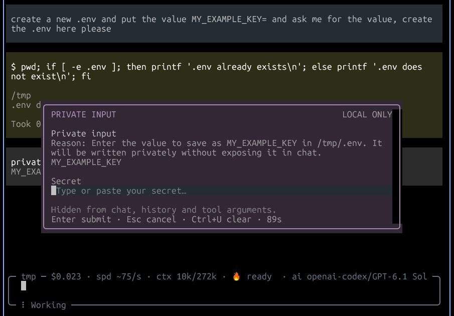

# pi-private-input

Private credential input and explicit SSH/sudo helpers for Pi. Secrets stay out of chat, history and tool arguments.

The model never sees the secret. It receives a one-use opaque handle and consumes it only with explicit user confirmation: writing an env variable to a dotenv file, injecting it into a single command's environment, or piping it to stdin.



## Install

From npm:

```sh
pi install npm:pi-private-input
```

From GitHub:

```sh
pi install git:github.com/dirop1/pi-private-input
```

From a local checkout:

```sh
pi install /path/to/pi-private-input
```

Requires Node.js 22+ and Pi interactive terminal mode. Package metadata includes `pi-package` for discovery in the [Pi package gallery](https://pi.dev/packages).

## Tools

| Tool | Purpose |
|---|---|
| `private_input` | Ask the user for a secret in a private masked terminal modal. Returns a one-use opaque handle, never the secret. Do not ask the user to paste credentials into chat. |
| `private_apply` | Use a one-use handle with user confirmation: `write-env` (dotenv file, mode `0600`), `run-env` (single command environment), or `run-stdin` (secret plus newline to stdin). Never interpolates the secret into shell source or prints it for the model. |
| `ssh_unlock` | Select and load a local SSH key for Git/SSH. A private modal sends the passphrase only to `ssh-add`. Reuses an accessible ssh-agent when available; otherwise starts a Pi-owned ssh-agent. |
| `sudo_exec` | Run an explicitly user-approved sudo command locally or on a POSIX SSH host. Credentials are entered privately and not cached by this extension. |

Model calls to `private_input`, `ssh_unlock`, and `sudo_exec` require a non-blank public `reason` (maximum 200 characters). Explain why the credential or permission is needed and what it will be used for; never include credentials. The explanation is shown in the request and masked authentication modal.

## Commands

```text
/private-input [label]     Collect a private one-use input (or /private-input forget to discard retained inputs)
/ssh-unlock                Select and load an SSH key without putting the passphrase in chat
/sudo-auth [SSH host]      Privately authenticate sudo; cache scope follows the machine policy
```

Slash commands show their results only as UI notifications; they do not send a result to the model or trigger an assistant response. For example, `/ssh-unlock` lets you load a key manually without sending a new message to the assistant. Model-called tools such as `ssh_unlock` return success or failure directly to the assistant. After `/private-input`, share only the displayed handle with the assistant if you want it to use the input.

`sudo_exec` with a `host` requires non-interactive SSH authentication first (use `ssh_unlock` for keys). Remote commands run through a fixed bootstrap that consumes the password before the approved command starts.

## ssh-agent lifetime

An `ssh-agent` holds unlocked keys and performs authentication without asking for the passphrase each time.

- If Pi can access an `ssh-agent` already running when it starts (via `SSH_AUTH_SOCK`), it reuses that `ssh-agent`, even if it has no keys yet. Other terminals or programs connected to the same `ssh-agent` can also use the loaded key. Closing Pi does **not** unload it or stop that `ssh-agent`; its lifetime follows your existing `ssh-agent` setup.
- If no `ssh-agent` is accessible, Pi starts its own `ssh-agent`. SSH/Git launched by Pi can use it, and it is stopped when the Pi process exits. Reloading extensions or switching conversations does not stop it.

The passphrase is sent only to `ssh-add`; it is never returned to the model.

## Security model

- Masked modal shows only a character count, never the secret. The secret is held in zeroed buffers and cleared on use, cancel, session change or shutdown.
- Handles are single-use, random (`private:<hex>`), capped at 32 retained inputs.
- Tool results are redacted (raw, base64, URL-encoded and JSON-escaped forms) before returning. Oversized output is withheld rather than partially returned.
- Dotenv writes are atomic with `0600` permissions and reject symlinks or non-regular files. Secrets containing single quotes are rejected for dotenv writes; use environment injection instead.
- The askpass bridge uses a private socket (`0600`) with a random token, a 2-minute prompt timeout and a 3-attempt limit.

This is **not a sandbox**: the approved command receives the secret and its output is only redacted on a best-effort basis. Review the destination and command before confirming.

## Development

```sh
npm test
npm run check
npm pack --dry-run --ignore-scripts
```

Tests use synthetic secrets and mocked ingestion; they never touch real credentials, keys or agents. Pi loads the TypeScript entrypoint directly; no build or dependency installation is needed.

## License

MIT. See [LICENSE](./LICENSE).
